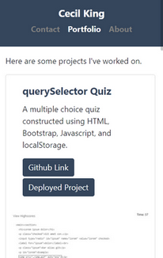
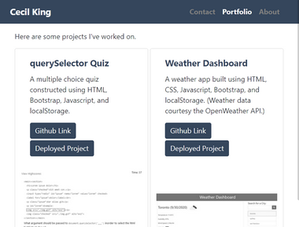
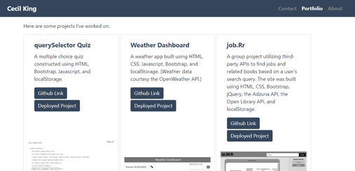

# React Project Portfolio

This repo contains a [website](https://cek333.github.io/React_Project_Portfolio/) showcasing front-end, back-end and full-stack projects I've worked on. The site was built using Bootstrap and React, and its responsive design adapts to various screen sizes. 

Here's an example showing the layout of the portfolio page on different screen sizes.

## Layout on Small Screens

## Layout on Medium-sized Screens

## Layout on Large Screens

You can view the deployed website [here](https://cek333.github.io/React_Project_Portfolio/).